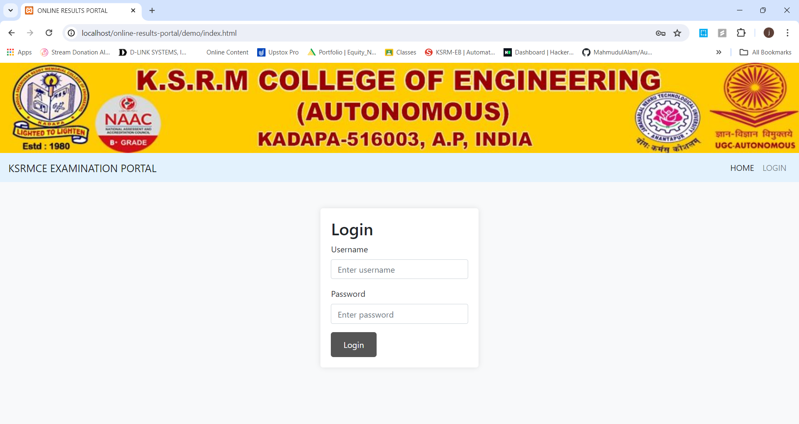

# Online Results Portal

## Table of Contents
  - Project Overview
  - Project Description
  - Features
  - Technologies Used
  - Installation
  - Usage
  - Screenshots
  - Conclusion

## Project Overview
The Online Results Portal is a web-based application aimed at simplifying the process of managing and displaying student results. The project is segmented into three main parts: Admin, Student, and Faculty. This README focuses on the contributions made to the Admin and Student parts, as well as the backend development, which I handled. The Faculty part, developed using Python and Flask, was contributed by my colleague.

  1. Admin Section
     - The Admin section provides a platform for administrators to manage student data and results. Key functionalities include:
       - Secure login for administrators.
       - Adding and updating student information.
       - Inputting and managing student results.
       - Generating and viewing comprehensive reports.
  2. Student Section
     - The Student section is designed to offer students a straightforward way to access their academic results. Key functionalities include:
       - Secure login for students.
       - Viewing personal academic results.
       - Accessing detailed academic records.
  3. Faculty Section
     - The Faculty section, developed using Python and Flask, allows faculty members to:
       - Securely log in.
       - View analysis of student results.
       - Access detailed student results.
       - View subject statistics and performance.
  5. Backend Development
     - The backend of the application is powered by PHP and MySQL. Key aspects of the backend development include:
       - Implementing secure authentication systems for both admin and student users.
       - Designing and managing the database schema in MySQL.
       - Developing server-side logic and scripts in PHP to handle data processing and database interactions.
       - Using PHP Mailer to send notifications when users log in.

## Project Description
The Online Results Portal is developed to facilitate educational institutions in managing and disseminating student academic results efficiently. The portal includes dedicated sections for administrators, students, and faculty, each tailored to their specific needs.

  1. Admin Section
     - Administrators can log in securely to access a dashboard where they can manage all student-related data. The admin functionalities are designed to be user-friendly, ensuring that non-technical staff can operate the system without difficulty.
  2. Student Section
     - Students can log in to view their results securely. The interface is intuitive, allowing students to easily navigate and find their results. The results are displayed in a detailed manner, ensuring transparency and clarity.
  3. Faculty Section
     - Faculty members can log in to access detailed analyses of student performance and subject statistics. This section is developed using Python and Flask, providing an efficient and interactive platform for faculty members to monitor and analyze academic performance.
  4. Backend Development
     - The backend is robust and secure, ensuring that all data transactions are processed efficiently. Security is a priority, with measures in place to protect sensitive student data from unauthorized access.

## Features
  - Secure admin login and management.
  - Secure student login and result viewing.
  - Secure faculty login and access to analysis and statistics.
  - Efficient and user-friendly interface for admin, students, and faculty.
  - Robust backend with secure authentication and data handling.
  - PHP Mailer for sending notifications upon login.

## Technologies Used

### Front End
  - HTML
  - CSS
  - JavaScript
### Back End
  - PHP
  - MySQL
  - Python
  - Flask

## Installation
  
## Version
```
Python >= 3.7.0 or anaconda
```

## Usage
Installation and Cloning Project:
```
git clone https://github.com/Jagadeeswar-reddy-c/Online-Results-Portal.git
cd online-results-portal
```

  1. Import the database:
     - Create a database in MySQL.
     - Import the provided SQL file (`function.php`) into your database. This will automatically create all necessary tables.
  2. Configure PHP Mailer in `admin_login.php`:
```
Line 47 & 53

$mail->Username = '########@gmail.com'; // Your email address

Password

$mail->Password = '#########'; // Your email password
```
  3. Set up the Flask environment for the Faculty section:
     - Install Flask and other dependencies:
```
pip install Flask
pip install mysql-connector-python
```
  4. Run the Flask app:
```
cd Faculty
python app.py
```
  5. Run the application on your local server (e.g., XAMPP, WAMP for PHP and MySQL, Flask for Python).
## Usage
  - Admins can log in and manage student results.
  - Students can log in and view their results.
  - Faculty members can log in and view analysis, student results, and subject statistics.
  - Notifications are sent to users upon login using PHP Mailer.

## Screenshots



## Conclusion
In conclusion, the development of the Online Results Portal has been a collaborative effort resulting in a comprehensive web application that facilitates the efficient management and accessibility of student academic results. Through the Admin, Student, and Faculty sections, tailored to the specific needs of each user group, administrators can streamline data management, students can securely access their results and records, and faculty members can analyze student performance and subject statistics conveniently. Powered by PHP, MySQL, Python, and Flask, with additional functionality provided by PHP Mailer for notifications, the portal ensures robustness, security, and user-friendliness. This project represents our commitment to innovation in educational technology and promises to be an invaluable asset for educational institutions seeking to improve their academic management processes.
